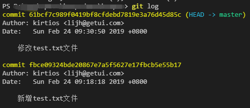

# 1、中央式版本控制系统

git是分布式版本控制系统，在讲git之前，先来了解下中央式版本控制系统。常用的有CVS、SVN.

### 1.1、工作模型
假设你在一个三人团队，你们计划开发一个软件或者系统，并决定使用中央式 VCS 来管理代码。于是：

1. 作为项目的主工程师，你独自一人花两天时间搭建了项目的框架；
2. 然后，你在公司的服务器（这个服务器可以是公司内的设备，也可以是你们买的云服务）上创建了一个中央仓库，并把你的代码提交到了中央仓库上；
3. 你的两个队友从中央仓库取到了你的初始代码，从此刻开始，你们三人开始并行开发；
4. 在之后的开发过程中，你们三人为了工作方便，总是每人独立负责开发一个功能，在这个功能开发完成后，这个人就把他的这些新代码提交到中央仓库；
5. 每次当有人把代码提交到中央仓库的时候，另外两个人就可以选择把这些代码同步到自己的机器上，保持自己的本地代码总是最新的。


而对于团队中的每个人来说，就会更简单一点：

1. 第一次加入团队时，把中央仓库的代码取下来；
2. 写完的新功能提交到中央仓库；
3. 同事提交到中央仓库的新代码，及时同步下来。

# 2、分布式版本控制系统

分布式 VCS （Distributed VCS / DVCS）和中央式的区别在于，分布式 VCS 除了中央仓库之外，还有本地仓库：团队中每一个成员的机器上都有一份本地仓库，这个仓库里包含了所有的版本历史，或者换句话说，每个人在自己的机器上就可以提交代码、查看历史，而无需联网和中央仓库交互——当然，取而代之的，你需要和本地仓库交互。

中央式 VCS 的中央仓库有两个主要功能：保存版本历史、同步团队代码。而在分布式 VCS 中，保存版本历史的工作转交到了每个团队成员的本地仓库中，中央仓库就只剩下了同步团队代码这一个主要任务。它的中央仓库依然也保存了历史版本，但这份历史版本更多的是作为团队间的同步中转站。

### 2.1、工作模型

依然以三人团队为例，分布式 VCS 的工作模型大致是这样：

1. 首先，你作为主工程师，独立搭建了项目架构，并把这些代码提交到了本地仓库；
2. 然后，你在服务器上创建了一个中央仓库，并把 1 中的提交从本地仓库推送到了服务器的中央仓库；
3. 其他同事把中央仓库的所有内容克隆到本地，拥有了各自的本地仓库，从此刻开始，你们三人开始并行开发；
4. 在之后的开发过程中，你们三人总是每人独立负责开发一个功能，在这个功能开发过程中，一个人会把它的每一步改动提交到本地仓库。注意：由于本地提交无需立即上传到中央仓库，所以每一步提交不必是一个完整功能，而可以是功能中的一个步骤或块。
5. 在一个人把某个功能开发完成之后，他就可以把这个功能相关的所有提交从本地仓库推送到中央仓库；
6. 每次当有人把新的提交推送到中央仓库的时候，另外两个人就可以选择把这些提交同步到自己的机器上，并把它们和自己的本地代码合并。


### 2.2、优点与缺点

分布式 VCS 的优点：

1. 大多数的操作可以在本地进行，所以速度更快，而且由于无需联网，所以即使不在公司甚至没有在联网，你也可以提交代码、查看历史，从而极大地减小了开发者的网络条件和物理位置的限制（例如，你可以在飞机上提交代码、切换分支等等）；
2. 由于可以提交到本地，所以你可以分步提交代码，把代码提交做得更细，而不是一个提交包含很多代码，难以 review 也难以回溯。


分布式 VCS 的缺点：

1. 由于每一个机器都有完整的本地仓库，所以初次获取项目（Git 术语：clone）的时候会比较耗时；
2. 由于每个机器都有完整的本地仓库，所以本地占用的存储比中央式 VCS 要高。

### 2.3、分布式和中央式的具体比较

　　首先，分布式版本控制系统根本没有“中央服务器”，每个人的电脑上都是一个完整的版本库，这样，你工作的时候，就不需要联网了，因为版本库就在你自己的电脑上。既然每个人电脑上都有一个完整的版本库，那多个人如何协作呢？比方说你在自己电脑上改了文件A，你的同事也在他的电脑上改了文件A，这时，你们俩之间只需把各自的修改推送给对方，就可以互相看到对方的修改了。

　　和集中式版本控制系统相比，分布式版本控制系统的安全性要高很多，因为每个人电脑里都有完整的版本库，某一个人的电脑坏掉了不要紧，随便从其他人那里复制一个就可以了。而集中式版本控制系统的中央服务器要是出了问题，所有人都没法干活了。

　　在实际使用分布式版本控制系统的时候，其实很少在两人之间的电脑上推送版本库的修改，因为可能你们俩不在一个局域网内，两台电脑互相访问不了，也可能今天你的同事病了，他的电脑压根没有开机。因此，分布式版本控制系统通常也有一台充当“中央服务器”的电脑，但这个服务器的作用仅仅是用来方便“交换”大家的修改，没有它大家也一样干活，只是交换修改不方便而已。


# 3、Git基本工作模式

首先理解三个基本概念：

- 工作区：就是你在电脑里能看到的目录
- 版本库：工作区有一个隐藏目录.git，这个不算工作区，而是Git的本地版本库,你的所有版本信息都会存在这里
- 暂存区：英文叫stage, 或index。一般存放在 ".git目录下" 下的index文件（.git/index）中，所以我们把暂存区有时也叫作索引（index）


### 3.1、工作模型

- 1.首先新建一个test.txt文件并对其进行修改，通过status可以查看工作目录当前状态，此时test.txt对git来说是不存在的（Untracked）


- 2.然后通过add命令将修改放入暂存区（git开始追踪它）


可以看到，test.txt 的文字变成了绿色，它的前面多了「new file:」的标记，而它的描述也从 "Untracked files" 变成了 "Changes to be commited"。这些都说明一点：test.txt 这个文件的状态从 "untracked"（未跟踪）变成了 "staged"（已暂存），意思是这个文件中被改动的部分（也就是这整个文件）被记录进了 staging area（暂存区）

stage 这个词在 Git 里，是「集中收集改动以待提交」的意思；而 staging area ，就是一个「汇集待提交的文件改动的地方」。简称「暂存」和「暂存区」。至于 staged 表示「已暂存」，就不用再解释了吧？

- 3.现在文件已经放入暂存区，可以用commit命令提交：


在这里你也可以直接commit提交会进入commit信息编辑页面，而加上-m参数可以快捷输入简短的提交备注信息，这样你就完成了一次提交（可以通过git log查看提交历史）

- 4.接着对该文件再次进行修改，输入git status可以看到，该文件又变红了，不过这次它左边的文字不是 "New file:" 而是 "modified:"，而且上方显示它的状态也不是 "Untracked" 而是 "not staged for commit"，意思很明确：Git 已经认识这个文件了，它不是个新文件，但它有了一些改动。所以虽然状态的显示有点不同，但处理方式还是一样的：


接下来再次将该文件add、commit，查看log可以看到已经存在两条提交记录:


- 5.最后通过push把本地的所有commit上传到远程仓库


### 3.2、团队工作基本模型

1. 在上面基本操作的基础上，同事 commit 代码到他的本地，并 push 到远程仓库

2. 你把远程仓库新的提交通过 pull指令拉取到你的本地

通过这个流程，你和同事就可以简单地合作了：你写了代码，commit，push 到远程仓库，然后他 pull 到他的本地；他再写代码，commit, push 到远程仓库，然后你再 pull 到你的本地。你来我往，配合得不亦乐乎。（但是有时候push会失败）

>为什么会失败？
>
>因为 Git 的push 其实是用本地仓库的commit记录去覆盖远程仓库的commit记录（注：这是简化概念后的说法，push 的实质和这个说法略有不同），而如果在远程仓库含有本地没有的commit的时候，push （如果成功）将会导致远端的commit被擦掉。这种结果当然是不可行的，因此 Git 会在 push 的时候进行检查，如果出现这样的情况，push 就会失败
这时只需要先通过git pull（实为fetch和merge的组合操作）将本地仓库的提交和远程仓库的提交进行合并，然后再push就可以了

这时只需要先通过git pull（实为fetch和merge的组合操作）将本地仓库的提交和远程仓库的提交进行合并，然后再push就可以了


# 4、Git时光穿梭

### 1.查看当前文件的改动`git diff`

假如我们拉下来一个仓库包含一个readme.txt文件。内容为

```
Git is a version control system.
```

修改内容为：

```
Git is free software.
```

现在，运行`git status`命令看看结果：

```
$ git status
On branch master
Changes not staged for commit:
  (use "git add <file>..." to update what will be committed)
  (use "git checkout -- <file>..." to discard changes in working directory)

    modified:   readme.txt

no changes added to commit (use "git add" and/or "git commit -a")
```

上面的命令输出告诉我们，readme.txt被修改过了。时间长了，如果你想知道你之前修改了什么，就使用`git diff`命名查看：

```
$ git diff readme.txt 
diff --git a/readme.txt b/readme.txt
index 46d49bf..9247db6 100644
--- a/readme.txt
+++ b/readme.txt
@@ -1,2 +1,2 @@
-Git is a version control system.
+Git is free software.
```

### 2.版本回退

你不断对文件进行修改，然后不断提交修改到版本库里。每当你觉得文件修改到一定程度的时候，就可以“保存一个快照”，这个快照在Git中被称为commit。一旦你把文件改乱了，或者误删了文件，还可以从最近的一个commit恢复，然后继续工作，而不是把几个月的工作成果全部丢失。

我们可以通过`git log`查看commit历史，git log命令显示从最近到最远的提交日志。提交日志的格式可以改变，详情参考[查看提交历史](https://git-scm.com/book/zh/v2/Git-%E5%9F%BA%E7%A1%80-%E6%9F%A5%E7%9C%8B%E6%8F%90%E4%BA%A4%E5%8E%86%E5%8F%B2)

之前我有三次提交记录
```
$ git log
commit 0f65ef0f4bc6b9a524fe95cf750282f63fd0d8a1 (HEAD -> master)
Author: tuo.chang <changpioneer@126.com>
Date:   Sun Nov 17 18:12:50 2019 +0800

    add 333333

commit f033ed21c6f6c31e7c5c9b136f718c8043661d85
Author: tuo.chang <changpioneer@126.com>
Date:   Sun Nov 17 18:12:24 2019 +0800

    add 222222

commit ec2b48ae279723fe8157e85c19e6ebdb9c7211f9
Author: tuo.chang <changpioneer@126.com>
Date:   Sun Nov 17 18:11:57 2019 +0800

    add 11111
```

在准备穿梭之前，我们要知道当前版本是哪个版本，用`HEAD`表示当前版本，也就是最新的提交`0f65ef0f4bc6b9a524fe95cf750282f63fd0d8a1`。上一个版本就是`HEAD^`，上上一个版本就是`HEAD^^`，当然往上100个版本写100个^比较容易数不过来，所以写成`HEAD~100`。

现在，我们要把当前版本`add 33333333`回退到上一个版本`add 222222222`，就可以使用`git reset`命令：

```
$ git reset --hard HEAD^
HEAD is now at f033ed2 add 222222
```

`--hard`参数有啥意义？这个后面再讲，现在你先放心使用。

看看`readme.txt`的内容是不是版本`add 222222`当时的内容：
```
$ cat readme.txt
222222222
```

还原成功了。

我们用`git log`再看看现在版本库的状态：

```
$ git log
commit f033ed21c6f6c31e7c5c9b136f718c8043661d85 (HEAD -> master)
Author: tuo.chang <changpioneer@126.com>
Date:   Sun Nov 17 18:12:24 2019 +0800

    add 222222

commit ec2b48ae279723fe8157e85c19e6ebdb9c7211f9
Author: tuo.chang <changpioneer@126.com>
Date:   Sun Nov 17 18:11:57 2019 +0800

    add 11111
```

最新的那个版本`add 33333333`已经看不到了。好比你从21世纪坐时光穿梭机来到了19世纪，想再回去已经回不去了，肿么办？

办法其实还是有的，只要上面的命令行窗口还没有被关掉，你就可以顺着往上找啊找啊，找到那个`add 33333333`的`commit id`是`0f65ef0f4bc6b9a524fe95cf750282f63fd0d8a1`，于是就可以指定回到未来的某个版本：

```
$ git reset --hard 0f65ef0f4bc6b9a524fe95cf750282f63fd0d8a1
HEAD is now at 0f65ef0 add 333333
```

Git的版本回退速度非常快，因为Git在内部有个指向当前版本的HEAD指针，当你回退版本的时候，Git仅仅是把HEAD从指向`add 3333333`:
```
┌────┐
│HEAD│
└────┘
   │
   └──> ○ add 333333
        │
        ○ add 22222
        │
        ○ add 11111
```

改为指向`add 222222222`：

```
┌────┐
│HEAD│
└────┘
   │
   │    ○ add 33333
   │    │
   └──> ○ add 22222
        │
        ○ add 11111
```

然后顺便把工作区的文件更新了。所以你让`HEAD`指向哪个版本号，你就把当前版本定位在哪。

如果你找不到新版本的`commit id`怎么办？


在Git中，总是有后悔药可以吃的。当你用`$ git reset --hard HEAD^`回退到`add 22222`版本时，再想恢复到`add 33333`，就必须找到`add 33333`的commit id。Git提供了一个命令`git reflog`用来记录你的每一次命令：

```
$ git reflog
0f65ef0 (HEAD -> master) HEAD@{0}: reset: moving to 0f65ef0f4bc6b9a524fe95cf750282f63fd0d8a1
f033ed2 HEAD@{1}: reset: moving to HEAD^
0f65ef0 (HEAD -> master) HEAD@{2}: commit: add 333333
f033ed2 HEAD@{3}: commit: add 222222
ec2b48a HEAD@{4}: commit: add 11111
```

现在总结一下：

- HEAD指向的版本就是当前版本，因此，Git允许我们在版本的历史之间穿梭，使用命令`git reset --hard commit_id`。

- 穿梭前，用`git log`可以查看提交历史，以便确定要回退到哪个版本。

- 要重返未来，用`git reflog`查看命令历史，以便确定要回到未来的哪个版本。


### 3.管理修改

为什么Git比其他版本控制系统设计得优秀，因为Git跟踪并管理的是修改，而非文件。

你会问，什么是修改？比如你新增了一行，这就是一个修改，删除了一行，也是一个修改，更改了某些字符，也是一个修改，删了一些又加了一些，也是一个修改，甚至创建一个新文件，也算一个修改。

为什么说Git管理的是修改，而不是文件呢？我们还是做实验。第一步，对readme.txt做一个修改，比如加一行内容：
```
33333333
My name is Hello
```

然后`git add`
```
$ git add .
$ git status
On branch master
Your branch is based on 'origin/master', but the upstream is gone.
  (use "git branch --unset-upstream" to fixup)

Changes to be committed:
  (use "git reset HEAD <file>..." to unstage)

    modified:   readme.md
```


然后，再修改readme.txt：

```
33333333
My name is Hello World.
```

提交：

```
$ git commit -m "add World"
[master 5114af7] add World
 1 file changed, 2 insertions(+), 1 deletion(-)
```

提交后，再看看状态：

```
$ git status
On branch master
Your branch is based on 'origin/master', but the upstream is gone.
  (use "git branch --unset-upstream" to fixup)

Changes not staged for commit:
  (use "git add <file>..." to update what will be committed)
  (use "git checkout -- <file>..." to discard changes in working directory)

    modified:   readme.md

no changes added to commit (use "git add" and/or "git commit -a")
```

咦，怎么第二次的修改没有被提交？

别激动，我们回顾一下操作过程：

第一次修改 -> `git add` -> 第二次修改 -> `git commit`

你看，我们前面讲了，Git管理的是修改，当你用`git add`命令后，在工作区的第一次修改被放入暂存区，准备提交，但是，在工作区的第二次修改并没有放入暂存区，所以，`git commit`只负责把暂存区的修改提交了，也就是第一次的修改被提交了，第二次的修改不会被提交。


提交后，用`git diff HEAD -- readme.md`命令可以查看工作区和版本库里面最新版本的区别：

```
$ git diff HEAD -- readme.md 
diff --git a/readme.md b/readme.md
index cc0321c..f394f5f 100644
--- a/readme.md
+++ b/readme.md
@@ -1,2 +1,2 @@
 33333333
-My name is Hello
\ No newline at end of file
+My name is Hello World.
\ No newline at end of file
```


### 4.撤销修改

你添加了一行文字：
```
33333333
My name is Hello World.
I am a hero.
```

在你准备提交前,突然觉得`I am a hero.`有点不合适。
既然错误发现得很及时，就可以很容易地纠正它。你可以删掉最后一行，手动把文件恢复到上一个版本的状态。

如果改动特别多时怎么办？用`git checkout -- file`可以丢弃工作区的修改：

```
$ git checkout -- readme.md
```


命令`git checkout -- readme.txt`意思就是，把`readme.md`文件在工作区的修改全部撤销，这里有两种情况：

- 一种是`readme.md`自修改后还没有被放到暂存区，现在，撤销修改就回到和版本库一模一样的状态；

- 一种是`readme.md`已经添加到暂存区后，又作了修改，现在，撤销修改就回到添加到暂存区后的状态。

总之，就是让这个文件回到最近一次`git commit`或`git add`时的状态。


**注意**: `git checkout -- file`命令中的`--`很重要，没有`--`，就变成了“切换到另一个分支”的命令，我们在后面的分支管理中会再次遇到`git checkout`命令。


现在假定是凌晨3点，你不但写了一些胡话，还`git add`到暂存区了：

```
33333333
My name is Hello
I am a hero.
My boss is stupid.

$git add .
```

庆幸的是，在commit之前，你发现了这个问题。用`git status`查看一下，修改只是添加到了暂存区，还没有提交：

```
pioneerdembp:Test pioneerchang$ git status
On branch master
Your branch is based on 'origin/master', but the upstream is gone.
  (use "git branch --unset-upstream" to fixup)

Changes not staged for commit:
  (use "git add <file>..." to update what will be committed)
  (use "git checkout -- <file>..." to discard changes in working directory)

    modified:   readme.md

no changes added to commit (use "git add" and/or "git commit -a")
```

Git告诉我们，用命令`git reset HEAD <file>`可以把暂存区的修改撤销掉（unstage），重新放回工作区：

```
$ git reset HEAD readme.md 
Unstaged changes after reset:
M   readme.md
```

`git reset`命令既可以回退版本，也可以把暂存区的修改回退到工作区。当我们用HEAD时，表示最新的版本。

再用`git status`查看一下，现在暂存区是干净的，工作区有修改：

```
$ git status
On branch master
Your branch is based on 'origin/master', but the upstream is gone.
  (use "git branch --unset-upstream" to fixup)

Changes not staged for commit:
  (use "git add <file>..." to update what will be committed)
  (use "git checkout -- <file>..." to discard changes in working directory)

    modified:   readme.md
```

还记得如何丢弃工作区的修改吗？

```
$ git checkout -- readme.md 

$ git status
On branch master
Your branch is based on 'origin/master', but the upstream is gone.
  (use "git branch --unset-upstream" to fixup)

nothing to commit, working tree clean
```

### 5.删除文件

版本库里面有个文件test.md，现在不用了，需要删除。一般情况下，你通常直接在文件管理器中把没用的文件删了，或者用rm命令删了：
```
$ rm test.md
```

这个时候，Git知道你删除了文件，因此，工作区和版本库就不一致了，`git status`命令会立刻告诉你哪些文件被删除了：

```
$ git status
On branch master
Your branch is based on 'origin/master', but the upstream is gone.
  (use "git branch --unset-upstream" to fixup)

Changes not staged for commit:
  (use "git add/rm <file>..." to update what will be committed)
  (use "git checkout -- <file>..." to discard changes in working directory)

    deleted:    test.md

```

现在你有两个选择，一是确实要从版本库中删除该文件，那就用命令`git rm`删掉，并且`git commit`：

```
$ git rm test.md
rm 'test.md'

$ git commit -m "remove test.md"
[master d46f35e] remove test.md
 1 file changed, 1 deletion(-)
 delete mode 100644 test.md
```


另一种情况是删错了，因为版本库里还有呢，所以可以很轻松地把误删的文件恢复到最新版本：

```
$ git checkout -- test.txt
```

`git checkout`其实是用版本库里的版本替换工作区的版本，无论工作区是修改还是删除，都可以“一键还原”。


# 5、分支管理

### 1.创建与合并分支

在版本回退里，你已经知道，每次提交，Git都把它们串成一条时间线，这条时间线就是一个分支。截止到目前，只有一条时间线，在Git里，这个分支叫主分支，即`master`分支。`HEAD`严格来说不是指向提交，而是指向`master`，`master`才是指向提交的，所以，`HEAD`指向的就是当前分支。

一开始的时候，`master`分支是一条线，Git用`master`指向最新的提交，再用`HEAD`指向`master`，就能确定当前分支，以及当前分支的提交点：


每次提交，`master`分支都会向前移动一步，这样，随着你不断提交，`master`分支的线也越来越长。

当我们创建新的分支，例如`dev`时，Git新建了一个指针叫`dev`，指向`master`相同的提交，再把`HEAD`指向`dev`，就表示当前分支在`dev`上：


你看，Git创建一个分支很快，因为除了增加一个`dev`指针，改改`HEAD`的指向，工作区的文件都没有任何变化！

不过，从现在开始，对工作区的修改和提交就是针对`dev`分支了，比如新提交一次后，`dev`指针往前移动一步，而`master`指针不变：


假如我们在`dev`上的工作完成了，就可以把`dev`合并到`master`上。Git怎么合并呢？最简单的方法，就是直接把`master`指向`dev`的当前提交，就完成了合并：


所以Git合并分支也很快！就改改指针，工作区内容也不变！


合并完分支后，甚至可以删除`dev`分支。删除`dev`分支就是把`dev`指针给删掉，删掉后，我们就剩下了一条`master`分支：


**下面开始实战**

首先，我们创建`dev`分支，然后切换到`dev`分支：

```
$ git checkout -b dev
Switched to a new branch 'dev'
```

`git checkout`命令加上`-b`参数表示创建并切换，相当于以下两条命令：

```
$ git branch dev
$ git checkout dev
```

然后，用git branch命令查看当前分支, `git branch`命令会列出所有分支，当前分支前面会标一个`*`号：

```
$ git branch
* dev
  master
```

然后，我们就可以在`dev`分支上正常提交，比如对readme.md做个修改，加上一行，然后提交：

```
$ git add readme.md
$ git commit -m "branch test"
[dev b17d20e] branch test
 1 file changed, 1 insertion(+)
```

现在，`dev`分支的工作完成，我们就可以切换回`master`分支：

```
$ git checkout master
Switched to branch 'master'
```

切换回`master`分支后，再查看一个readme.md文件，刚才添加的内容不见了！因为那个提交是在`dev`分支上，而`master`分支此刻的提交点并没有变：


现在，我们把`dev`分支的工作成果合并到`master`分支上：

```
$ git merge dev
Updating d46f35e..b17d20e
Fast-forward
 readme.txt | 1 +
 1 file changed, 1 insertion(+)
```

`git merge`命令用于合并指定分支到当前分支。合并后，再查看readme.md的内容，就可以看到，和`dev`分支的最新提交是完全一样的。

注意到上面的`Fast-forward`信息，Git告诉我们，这次合并是“快进模式”，也就是直接把`master`指向`dev`的当前提交，所以合并速度非常快。

当然，也不是每次合并都能`Fast-forward`，我们后面会讲其他方式的合并。

合并完成后，就可以放心地删除`dev`分支了：
```
$ git branch -d dev
Deleted branch dev (was b17d20e).
```

**switch**

我们注意到切换分支使用`git checkout <branch>`，而前面讲过的撤销修改则是`git checkout -- <file>`，同一个命令，有两种作用，确实有点令人迷惑。

实际上，切换分支这个动作，用`switch`更科学。因此，最新版本的Git提供了新的`git switch`命令来切换分支：

创建并切换到新的`dev`分支，可以使用：

```
$ git switch -c dev
```

直接切换到已有的`master`分支，可以使用：
```
$ git switch master
```

使用新的`git switch`命令，比`git checkout`要更容易理解。


### 2.解决冲突

准备新的`feature1`分支，继续我们的新分支开发.修改readme.md最后一行，改为：

```
Victory won’t e to me unless I go to it.
```

在feature1分支上提交：
```
$ git add .
$ git commit -m "feature1 modify"
[feature1 fd94cd9] feature1 modify
 1 file changed, 1 insertion(+), 1 deletion(-)
```

切换到`master`分支，Git还会自动提示我们当前`master`分支比远程的`master`分支要超前1个提交。：

```
pioneerdembp:Test pioneerchang$ git checkout master
Switched to branch 'master'
Your branch is based on 'origin/master', but the upstream is gone.
  (use "git branch --unset-upstream" to fixup)
```

在`master`分支上修改readme.txt文件的最后一行并提交：

```
Other men live to eat， while I eat to live.
```

现在，`master`分支和`feature1`分支各自都分别有新的提交，变成了这样：


这种情况下，Git无法执行“快速合并”，只能试图把各自的修改合并起来，但这种合并就可能会有冲突，我们试试看：

```
$ git merge feature1
Auto-merging readme.md
CONFLICT (content): Merge conflict in readme.md
Automatic merge failed; fix conflicts and then commit the result.
```

果然冲突了！Git告诉我们，readme.md文件存在冲突，必须手动解决冲突后再提交。`git status`也可以告诉我们冲突的文件：

```
pioneerdembp:Test pioneerchang$ git status
On branch master
Your branch is based on 'origin/master', but the upstream is gone.
  (use "git branch --unset-upstream" to fixup)

You have unmerged paths.
  (fix conflicts and run "git commit")
  (use "git merge --abort" to abort the merge)

Unmerged paths:
  (use "git add <file>..." to mark resolution)

    both modified:   readme.md

no changes added to commit (use "git add" and/or "git commit -a")
```

我们可以直接查看readme.md的内容：

```
33333333
My name is Hello
<<<<<<< HEAD
Other men live to eat， while I eat to live.
=======
Victory won’t e to me unless I go to it.
>>>>>>> feature1
```

Git用`<<<<<<<`，`=======`，`>>>>>>>`标记出不同分支的内容，我们修改如下后保存：

```
33333333
My name is Hello
Other men live to eat， while I eat to live.
```

再提交, 现在，master分支和feature1分支变成了下图所示：


用带参数的`git log`可以看到分支的合并情况：

```
$ git log --graph --pretty=oneline --abbrev-commit
*   1d86cde (HEAD -> master) merge
|\  
| * fd94cd9 (feature1) feature1 modify
* | 12edfff master modify
|/  
* 336d553 delete test
* 4439ca0 add test
* 03a5695 add hero
* 06dcaca add World
* 1fabe89 add 3333
```

最后，删除feature1分支，工作完成！

### 3.分支管理策略

通常，合并分支时，如果可能，Git会用`Fast forward`模式，但这种模式下，删除分支后，会丢掉分支信息。

如果要强制禁用`Fast forward`模式，Git就会在`merge`时生成一个新的`commit`，这样，从分支历史上就可以看出分支信息。

下面我们实战一下`--no-ff`方式的`git merge`：

首先，仍然创建并切换`dev`分支，修改readme.md文件，并提交一个新的`commit`，然后我们切换回`master`，准备合并`dev`分支，请注意`--no-ff`参数，表示禁用`Fast forward`：

```
$ git merge --no-ff -m "merge with no-ff" dev
Merge made by the 'recursive' strategy.
 readme.md | 1 +
 1 file changed, 1 insertion(+)
```

因为本次合并要创建一个新的`commit`，所以加上`-m`参数，把`commit`描述写进去。

合并后，我们用`git log`看看分支历史：

```
pioneerdembp:Test pioneerchang$ git log --graph --pretty=oneline --abbrev-commit
*   8779f9b (HEAD -> master) merge with no-ff
|\  
| * 35815bc (dev) dev branch modify
|/  
*   1d86cde merge
...
```

可以看到，不使用Fast forward模式，merge后就像这样：


**分支策略**

在实际开发中，我们应该按照几个基本原则进行分支管理：

首先，`master`分支应该是非常稳定的，也就是仅用来发布新版本，平时不能在上面干活；

那在哪干活呢？干活都在`dev`分支上，也就是说，`dev`分支是不稳定的，到某个时候，比如1.0版本发布时，再把`dev`分支合并到`master`上，在`master`分支发布1.0版本；

你和你的小伙伴们每个人都在`dev`分支上干活，每个人都有自己的分支，时不时地往`dev`分支上合并就可以了。

所以，团队合作的分支看起来就像这样：


### 4.Bug分支

软件开发中，bug就像家常便饭一样。有了bug就需要修复，在Git中，由于分支是如此的强大，所以，每个bug都可以通过一个新的临时分支来修复，修复后，合并分支，然后将临时分支删除。

当你接到一个修复一个代号101的bug的任务时，很自然地，你想创建一个分支`issue-101`来修复它，但是，等等，当前正在`dev`上进行的工作还没有提交。并不是你不想提交，而是工作只进行到一半，还没法提交，预计完成还需1天时间。但是，必须在两个小时内修复该bug，怎么办？

幸好，Git还提供了一个`stash`功能，可以把当前工作现场“储藏”起来，等以后恢复现场后继续工作：

```
$ git stash
Saved working directory and index state WIP on dev: f52c633 add merge
```

现在，用`git status`查看工作区，就是干净的（除非有没有被Git管理的文件），因此可以放心地创建分支来修复bug。

首先确定要在哪个分支上修复bug，假定需要在`master`分支上修复，就从`master`创建临时分支：

```
$ git checkout master
Switched to branch 'master'
Your branch is ahead of 'origin/master' by 6 commits.
  (use "git push" to publish your local commits)

$ git checkout -b issue-101
Switched to a new branch 'issue-101'
```

现在修复bug，然后提交。切换到`master`分支，并完成合并，最后删除`issue-101`分支。

现在，可以接着回到`dev`分支干活了！

```
$ git checkout dev
Switched to branch 'dev'

$ git status
On branch dev
nothing to commit, working tree clean
```

工作区是干净的，刚才的工作现场存到哪去了？用`git stash list`命令看看：

```
$ git stash list
stash@{0}: WIP on dev: f52c633 add merge
```


工作现场还在，Git把stash内容存在某个地方了，但是需要恢复一下，有两个办法：

- 一是用`git stash apply`恢复，但是恢复后，stash内容并不删除，你需要用`git stash drop`来删除；

- 另一种方式是用`git stash pop`，恢复的同时把stash内容也删了.

```
$ git stash pop
On branch dev
Changes to be committed:
  (use "git reset HEAD <file>..." to unstage)

    new file:   hello.py

Changes not staged for commit:
  (use "git add <file>..." to update what will be committed)
  (use "git checkout -- <file>..." to discard changes in working directory)

    modified:   readme.txt

Dropped refs/stash@{0} (5d677e2ee266f39ea296182fb2354265b91b3b2a)
```

再用`git stash list`查看，就看不到任何stash内容了：

```
$ git stash list
```

你可以多次stash，恢复的时候，先用`git stash list`查看，然后恢复指定的stash，用命令：

```
$ git stash apply stash@{0}
```


在master分支上修复了bug后，我们要想一想，dev分支是早期从master分支分出来的，所以，这个bug其实在当前dev分支上也存在。那怎么在dev分支上修复同样的bug？

同样的bug，要在dev上修复，我们只需要把在bug分支`issue-101`上的那次提交(4c805e2 fix bug 101)所做的修改“复制”到dev分支。注意：我们只想复制`4c805e2 fix bug 101`这个提交所做的修改，并不是把整个master分支merge过来。

为了方便操作，Git专门提供了一个`cherry-pick`命令，让我们能复制一个特定的提交到当前分支：

```
$ git branch
* dev
  master

$ git cherry-pick 4c805e2
[master 1d4b803] fix bug 101
 1 file changed, 1 insertion(+), 1 deletion(-)
```

Git自动给dev分支做了一次提交，注意这次提交的commit是`1d4b803`，它并不同于master的`4c805e2`，因为这两个commit只是改动相同，但确实是两个不同的commit。用`git cherry-pick`，我们就不需要在dev分支上手动再把修bug的过程重复一遍。

有些聪明的童鞋会想了，既然可以在master分支上修复bug后，在dev分支上可以“重放”这个修复过程，那么直接在dev分支上修复bug，然后在master分支上“重放”行不行？当然可以，不过你仍然需要git stash命令保存现场，才能从dev分支切换到master分支。


### 5.Feature分支

软件开发中，总有无穷无尽的新的功能要不断添加进来。

添加一个新功能时，你肯定不希望因为一些实验性质的代码，把主分支搞乱了，所以，每添加一个新功能，最好新建一个feature分支，在上面开发，完成后，合并，最后，删除该feature分支。

现在，你终于接到了一个新任务：开发代号为Vulcan的新功能，该功能计划用于下一代星际飞船。

于是准备开发：
```
$ git checkout -b feature-vulcan
Switched to a new branch 'feature-vulcan'
```

5分钟后，开发完毕：
```
$ git add vulcan.py

$ git status
On branch feature-vulcan
Changes to be committed:
  (use "git reset HEAD <file>..." to unstage)

    new file:   vulcan.py

$ git commit -m "add feature vulcan"
[feature-vulcan 287773e] add feature vulcan
 1 file changed, 2 insertions(+)
 create mode 100644 vulcan.py
```

切回dev，准备合并：

```
$ git checkout dev
```

一切顺利的话，feature分支和bug分支是类似的，合并，然后删除。

但是！

就在此时，接到上级命令，因经费不足，新功能必须取消！

虽然白干了，但是这个包含机密资料的分支还是必须就地销毁：

```
$ git branch -d feature-vulcan
error: The branch 'feature-vulcan' is not fully merged.
If you are sure you want to delete it, run 'git branch -D feature-vulcan'.
```

销毁失败。Git友情提醒，feature-vulcan分支还没有被合并，如果删除，将丢失掉修改，如果要强行删除，需要使用大写的-D参数。。

现在我们强行删除：

```
$ git branch -D feature-vulcan
Deleted branch feature-vulcan (was 287773e).
```

终于删除成功！


